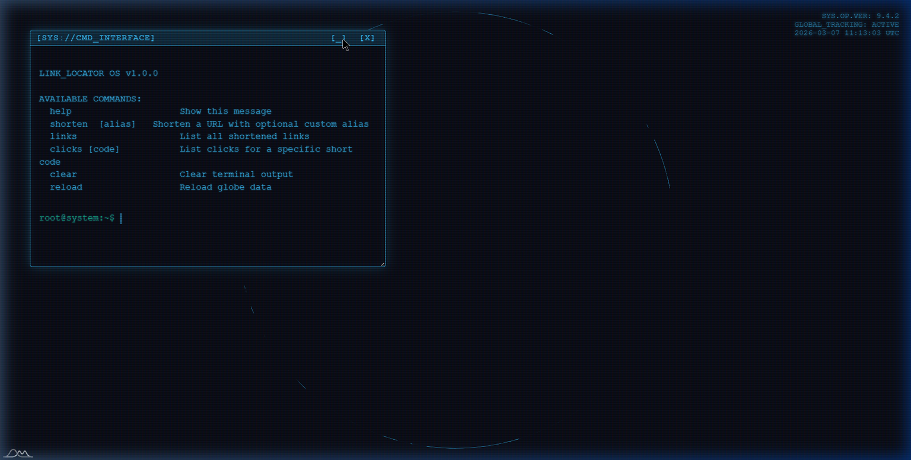
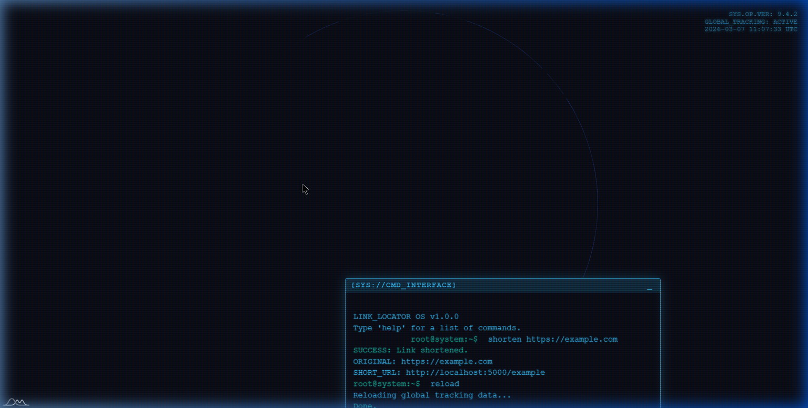

<div align="center">

<br/>

```
 ██████╗ ██╗  ██╗ ██████╗ ███████╗████████╗██╗     ██╗███╗   ██╗██╗  ██╗
██╔════╝ ██║  ██║██╔═══██╗██╔════╝╚══██╔══╝██║     ██║████╗  ██║██║ ██╔╝
██║  ███╗███████║██║   ██║███████╗   ██║   ██║     ██║██╔██╗ ██║█████╔╝ 
██║   ██║██╔══██║██║   ██║╚════██║   ██║   ██║     ██║██║╚██╗██║██╔═██╗ 
╚██████╔╝██║  ██║╚██████╔╝███████║   ██║   ███████╗██║██║ ╚████║██║  ██╗
 ╚═════╝ ╚═╝  ╚═╝ ╚═════╝ ╚══════╝   ╚═╝   ╚══════╝╚═╝╚═╝  ╚═══╝╚═╝  ╚═╝
```

### `LINK_LOCATOR OS v1.0.0` — *Zero-click. Full trace.*

<br/>


<br/>

*A covert URL shortener wrapped inside a hacker-aesthetic OS terminal, with a live 3D globe that maps every click in real time.*

<br/>

</div>

---
## 🎬 Live Demo

Click the image below to watch the demo:

[](https://youtu.be/3qA7qzza04c)

> **Walkthrough:** Minting a tracked link via the CMD interface → sharing it → watching the hot-pink globe pin appear live → clicking the pin to spawn the decrypted `[DATA://EXTRACT]` terminal overlay with full device fingerprint.

---

## 🖥️ Screenshots

| OS Terminal Interface | Data Extraction Modal |
|:---:|:---:|
|  |  |

---

## ⚡ What Is This?

**GhostLink** is a zero-click geographical tracking tool disguised as a URL shortener. When a target clicks your link anywhere in the world, the system silently captures their **precise location**, **device fingerprint**, **network metadata**, and **hardware specs** — all visualized on a live interactive 3D globe inside a cinematic OS-style terminal.

No dashboards. No boring tables. Just a black terminal and a spinning Earth lighting up with pink dots wherever your link has been clicked.

---

## 🧩 Core Features

| Feature | Description |
|---|---|
| 🖥️ **CMD Interface** | Full OS-mimicking terminal — every action runs as a command |
| 🌍 **3D amCharts Globe** | Orthographic, draggable globe with real-time click vector pins |
| 📡 **[DATA://EXTRACT]** | Click any globe pin → camera rotates + decrypted data terminal spawns |
| 🔍 **Client Fingerprinting** | IP, timezone, OS, architecture, CPU cores, RAM, screen resolution |
| 🌐 **Browser Geolocation** | Captures precise GPS if visitor grants permission |
| 📶 **Network Type Detection** | 2G / 3G / 4G / 5G / WiFi classification |
| 🤖 **Bot Detection** | Filters out automated traffic |
| 🔋 **Battery Level** | Captures device battery percentage |
| 🎨 **Color Depth** | Records display color depth |
| 📍 **Dual-Source GPS** | IP geolocation + browser GPS fallback system |

---

## 🚀 Quick Start

```bash
# 1. Clone the repo
git clone https://github.com/yourname/ghostlink.git
cd ghostlink

# 2. Create & activate virtual environment
python -m venv venv

# Windows
venv\Scripts\activate
# macOS / Linux
source venv/bin/activate

# 3. Install dependencies
pip install Flask SQLAlchemy requests user-agents

# 4. Launch the OS
python app.py
```

> 🌐 **Boot Port:** [http://127.0.0.1:5000](http://127.0.0.1:5000)

---

## 💻 Terminal Commands

Once inside the OS terminal, all interaction is command-driven:

```
LINK_LOCATOR OS v1.0.0 — type 'help' for available commands
> _
```

| Command | Syntax | Description |
|---|---|---|
| `help` | `help` | Display all available commands |
| `shorten` | `shorten <url> [alias]` | Mint a new tracked short-link payload |
| `links` | `links` | Query all active deployed links from DB |
| `clicks` | `clicks <code>` | Pull full click history for a link code |
| `ping` | `ping <code>` | Open a dedicated terminal window for a link |
| `reload` | `reload` | Repaint all globe vectors from database |
| `clear` | `clear` | Sweep the terminal screen |

---

## 🔬 Data Collected Per Click

Every inbound click silently records:

<table>
<tr>
<td valign="top">

**🌍 Location**
- Public IP address
- Country, Region, City
- Precise Latitude / Longitude
- Timezone

</td>
<td valign="top">

**📱 Device**
- Device type (Mobile / Desktop / Tablet)
- Brand & Model
- Operating System & Version
- System Architecture

</td>
<td valign="top">

**🌐 Network & Browser**
- ISP / Network Provider
- Connection Type (2G/3G/4G/5G/WiFi)
- Browser Name & Version
- CPU Logical Cores
- Estimated RAM
- Screen Resolution
- Color Depth
- Battery Level
- Bot Detection Flag

</td>
</tr>
</table>

---

## 🗺️ How It Works

```
User clicks link
      │
      ▼
┌─────────────────────┐
│  collector.html     │  ← Runs JS fingerprinting in visitor's browser
│  (intermediate page)│    Captures GPS, network type, hardware specs
└─────────┬───────────┘
          │  POST /api/click/<code>
          ▼
┌─────────────────────┐
│   Flask Backend     │  ← IP geolocation via ip-api.com
│   app.py            │    Stores everything to SQLite
└─────────┬───────────┘
          │
          ▼
┌─────────────────────┐
│  3D Globe Update    │  ← Hot-pink pin drops on globe at click coordinates
│  (amCharts)         │    Click pin → [DATA://EXTRACT] terminal spawns
└─────────────────────┘
```

> ⚠️ **GPS Note:** Visitors must click **Allow** on the browser location prompt, otherwise the system falls back to IP-based geolocation.

---

## 🔌 API Reference

<details>
<summary><b>POST /api/shorten</b> — Mint a new tracked link</summary>

```http
POST /api/shorten
Content-Type: application/json

{
  "url": "https://example.com/very/long/url",
  "alias": "optional-custom-code"
}
```

**Response:**
```json
{
  "short_url": "http://localhost:5000/aBcDeF",
  "short_code": "aBcDeF",
  "original_url": "https://example.com/very/long/url"
}
```
</details>

<details>
<summary><b>GET /api/analytics/&lt;code&gt;</b> — Full click analytics</summary>

```http
GET /api/analytics/aBcDeF
```

**Response:**
```json
{
  "short_code": "aBcDeF",
  "original_url": "https://example.com/very/long/url",
  "total_clicks": 42,
  "clicks": [
    {
      "ip_address": "203.0.113.42",
      "location": "Tokyo, Japan",
      "latitude": 35.6762,
      "longitude": 139.6503,
      "device_type": "Mobile",
      "device_brand": "Samsung",
      "device_model": "Galaxy S23",
      "os": "Android 13",
      "browser": "Chrome 119.0",
      "network_type": "5g",
      "cpu_cores": 8,
      "ram_gb": 8,
      "battery_level": 0.72,
      "is_bot": false,
      "clicked_at": "2026-03-08T04:00:00.000000"
    }
  ]
}
```
</details>

<details>
<summary><b>GET /api/urls</b> — List all active links</summary>

```http
GET /api/urls
```
</details>

---

## 📁 File Structure

```
ghostlink/
├── app.py                      # Flask backend — routing, DB, geolocation
├── requirements.txt            # Python dependencies
├── run.bat / run.sh            # One-click launch scripts
├── templates/
│   ├── index.html              # OS terminal + 3D globe interface
│   └── collector.html          # Silent JS fingerprinting page
├── assets/                     # Screenshots & captured feedback images
├── instance/
│   └── locator.db              # SQLite database (auto-created)
└── README.md
```

---

## 🌍 Deployment & Public Access

To collect real-world data, the server must be publicly reachable:

**Option 1 — Tunnel (easiest):**
```bash
# Using ngrok
ngrok http 5000
# Share the ngrok URL — e.g. https://abc123.ngrok.io/yourcode
```

**Option 2 — Cloud VPS:**
Deploy on any cloud provider (DigitalOcean, AWS, Hetzner). Set `host='0.0.0.0'` in `app.py` and open port `5000`.

**Option 3 — Change port:**
```python
# app.py — bottom of file
if __name__ == '__main__':
    app.run(debug=True, host='0.0.0.0', port=8080)
```

> ⚠️ Local IPs (`127.0.0.1`, `192.168.x.x`) will return **Unknown** for geolocation. You need a public IP for real map pins.

---

## 🔧 Troubleshooting

<details>
<summary><b>Port already in use</b></summary>

```bash
# Windows
netstat -ano | findstr :5000
taskkill /PID <PID> /F

# macOS / Linux
lsof -i :5000
kill -9 <PID>
```
</details>

<details>
<summary><b>Geolocation returns Unknown</b></summary>

- Ensure the app is exposed to the public internet
- Verify [ip-api.com](https://ip-api.com) is reachable (free tier: 45 req/min)
- Private/local IPs will never resolve to a real location
</details>

<details>
<summary><b>Database issues</b></summary>

Delete `instance/locator.db` and relaunch — the DB is auto-recreated on boot.
</details>

---

## 🛡️ Ethics & Legal

> ⚠️ **For educational and authorized testing only.**

- Always inform users if you are collecting their location or device data
- Comply with GDPR, CCPA, and applicable local privacy laws
- Do **not** use this tool on targets without explicit consent
- Use HTTPS and add authentication before any production deployment

---

## 🗄️ Database Schema

| Table | Key Fields |
|---|---|
| `shortened_url` | `id`, `original_url`, `short_code`, `alias`, `created_at` |
| `click` | `id`, `short_code`, `ip`, `lat`, `lng`, `city`, `country`, `os`, `browser`, `device_type`, `cpu_cores`, `ram`, `battery`, `network_type`, `is_bot`, `clicked_at` |

---

<div align="center">

---

*Built for educational & CTF use. Track responsibly.* 🌐

**`> LINK_LOCATOR OS — STANDING BY_`**

</div>

